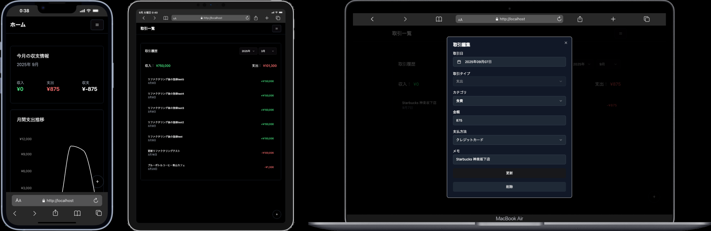

# household_accounting_app

<p align="center">
  
</p>

## 概要

モダンでシンプルな家計簿管理アプリ<br>
収入・支出カテゴリの追加や編集、月ごとの収支管理が可能<br>
React + TypeScript + Laravel を使用

- 無駄な機能が一切なくシンプルでモダンなUI設計
- SPA仕様のため高速で家計簿のデータ登録や更新等が可能

## 主な機能

- 月ごとの収支サマリ表示
- カテゴリ管理（収入/支出）
- 取引登録・編集・削除
- ダークモード対応

## セットアップ

1. リポジトリをクローン
2. `.env` をコピーして設定
3. 必要なパッケージをインストール

```sh
composer install
npm install
```

---

## English

### Overview

A modern and simple household accounting app.<br>
You can add/edit income and expense categories, and manage monthly balances.<br>
Built with React, TypeScript, and Laravel.

- Simple and modern UI design with no unnecessary features
- SPA architecture enables fast registration and updating of household data

### Main Features

- Monthly balance summary
- Category management (income/expense)
- Register, edit, and delete transactions
- Dark mode support

### Setup

1. Clone the repository
2. Copy and configure `.env`
3. Install required packages

```sh
composer install
npm install
```

---

## 한국어

### 개요

모던하고 심플한 가계부 관리 앱입니다.<br>
수입/지출 카테고리 추가 및 편집, 월별 수입/지출 관리가 가능합니다.<br>
React, TypeScript, Laravel로 제작되었습니다.

- 불필요한 기능 없이 심플하고 모던한 UI 설계
- SPA 구조로 빠르게 가계부 데이터 등록 및 갱신 가능

### 주요 기능

- 월별 수입/지출 요약 표시
- 카테고리 관리(수입/지출)
- 거래 등록, 편집, 삭제
- 다크 모드 지원

### 셋업

1. 저장소 클론
2. `.env` 복사 및 설정
3. 필요한 패키지 설치

```sh
composer install
npm install
```
