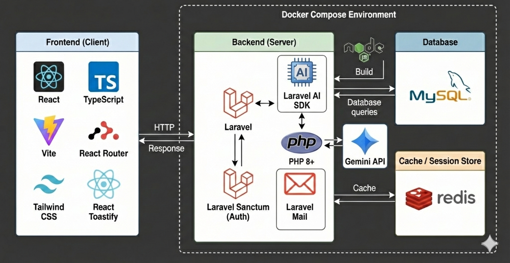

# household_accounting_app

<p align="center">
  
</p>

## 概要

-   モダンでシンプルな家計簿管理アプリ
-   収入/支出カテゴリの追加・編集・月毎の収支管理が可能
-   SPA 仕様により高速なデータ処理を実現
-   無駄な機能が一切なくシンプルでモダンなUI設計

## 技術スタック / アーキテクチャ


アーキテクチャ設計の詳細については、[docs/architecture.md](docs/architecture.md) を参照してください。

## 機能

-   月ごとの収支サマリ表示
-   カテゴリ管理（収入 / 支出）
-   取引登録 / 編集 / 削除
-   言語切替（英語 / 日本語 / 韓国語）
-   ダークモード対応
-   AI による支出管理アドバイス（※実装予定）

## セットアップ

1. リポジトリをクローン
2. `.env` をコピーして設定
3. 必要なパッケージをインストール

```sh
composer install
npm install
```

---

## English

### Overview

-   Modern and simple household accounting app
-   Capable of adding/editing income/expense categories and managing monthly balances
-   High-speed data processing achieved through SPA specifications
-   Simple and modern UI design with no unnecessary features

### Tech Stack / Architecture


For detailed architecture design, please refer to [docs/architecture.md](docs/architecture.md).

### Features

-   Monthly balance summary
-   Category management (Income / Expense)
-   Register, edit, and delete transactions
-   Language switching (English / Japanese / Korean)
-   Dark mode support
-   AI-based expenditure management advice (*Planned implementation)

### Setup

1. Clone the repository
2. Copy and configure `.env`
3. Install required packages

```sh
composer install
npm install
```

---

## 한국어

### 개요

-   모던하고 심플한 가계부 관리 앱
-   수입/지출 카테고리 추가·편집 및 월별 수지 관리 가능
-   SPA 사양으로 빠른 데이터 처리 실현
-   불필요한 기능이 없는 심플하고 모던한 UI 설계

### 기술 스택 / 아키텍처


아키텍처 설계에 대한 자세한 내용은 [docs/architecture.md](docs/architecture.md)를 참고해 주세요.

### 주요 기능

-   월별 수지 요약 표시
-   카테고리 관리 (수입 / 지출)
-   거래 등록 / 편집 / 삭제
-   언어 전환 (영어 / 일본어 / 한국어)
-   다크 모드 지원
-   AI를 활용한 지출 관리 조언 (※구현 예정)

### 셋업

1. 저장소 클론
2. `.env` 복사 및 설정
3. 필요한 패키지 설치

```sh
composer install
npm install
