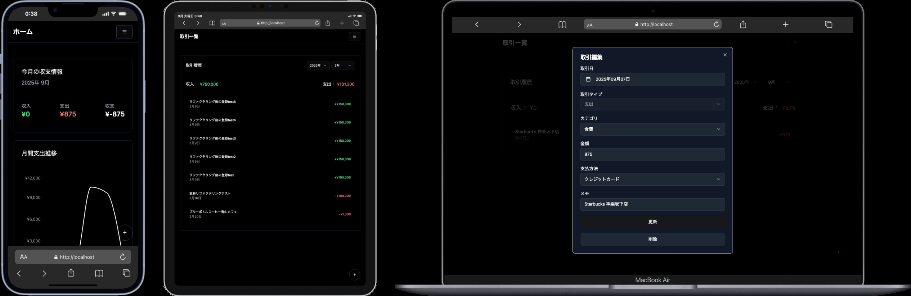

# household_accounting_app

<p align="center">
  
</p>

## 概要

-   モダンでシンプルな家計簿管理アプリ
-   収入/支出カテゴリの追加・編集・月毎の収支管理が可能
-   SPA 仕様により高速なデータ処理を実現
-   無駄な機能が一切なくシンプルでモダンなUI設計

## 技術スタック / アーキテクチャ


アーキテクチャ設計の詳細については、[docs/architecture.md](docs/architecture.md) を参照してください。

### 詳細な技術スタック

- フロントエンド
  - React 19 / TypeScript 5
  - Vite 6（`@vitejs/plugin-react`、`laravel-vite-plugin`）
  - React Router 7
  - Tailwind CSS 3（`tailwindcss-animate`、`tailwind-merge`）
  - Radix UI（Dialog / Select / Popover / Label / AlertDialog）
  - UI/Icon: `lucide-react`、`@heroicons/react`
  - 日付/カレンダー: `date-fns`、`date-fns-tz`、`react-day-picker`
  - グラフ: `recharts`

- バックエンド
  - PHP 8.2
  - Laravel 12
  - 認証: Laravel Sanctum 4、Laravel Breeze 2
  - メール/通知: Laravel Mail / Notification（例: EmailChangeCodeMail, ReactivateAccount）
  - AI 連携: `laravel/ai` 0.2（将来拡張含む）

- ビルド/開発ツール
  - TypeScript, PostCSS, Autoprefixer, Sass
  - Vite（ホットリロード、資産ビルド）

- 開発環境/その他
  - Node.js + npm（Vite 実行）
  - Docker Compose / Laravel Sail（任意）
  - ローカル DB: SQLite（初期化スクリプトで `database.sqlite` を作成）
  - テスト/品質: PHPUnit 11、Laravel Pint、Collision

## 機能

-   月ごとの収支サマリ表示
-   カテゴリ管理（収入 / 支出）
-   取引登録 / 編集 / 削除
-   予算管理機能
-   言語切替（英語 / 日本語 / 韓国語）
-   ダークモード対応
-   AI による支出管理アドバイス

## セットアップ

1. リポジトリをクローン
2. `.env` をコピーして設定
3. 必要なパッケージをインストール

```sh
composer install
npm install
```

---

## English

### Overview

-   Modern and simple household accounting app
-   Capable of adding/editing income/expense categories and managing monthly balances
-   High-speed data processing achieved through SPA specifications
-   Simple and modern UI design with no unnecessary features

### Tech Stack / Architecture


For detailed architecture design, please refer to [docs/architecture.md](docs/architecture.md).

### Detailed Tech Stack

- Frontend
  - React 19 / TypeScript 5
  - Vite 6 (`@vitejs/plugin-react`, `laravel-vite-plugin`)
  - React Router 7
  - Tailwind CSS 3 (`tailwindcss-animate`, `tailwind-merge`)
  - Radix UI (Dialog / Select / Popover / Label / AlertDialog)
  - UI/Icon: `lucide-react`, `@heroicons/react`
  - Date/Calendar: `date-fns`, `date-fns-tz`, `react-day-picker`
  - Charts: `recharts`

- Backend
  - PHP 8.2
  - Laravel 12
  - Auth: Laravel Sanctum 4, Laravel Breeze 2
  - Mail/Notifications: Laravel Mail / Notification (e.g., EmailChangeCodeMail, ReactivateAccount)
  - AI Integration: `laravel/ai` 0.2

- Build/Tooling
  - TypeScript, PostCSS, Autoprefixer, Sass
  - Vite (HMR and asset build)

- Dev Environment / Others
  - Node.js + npm (for Vite)
  - Docker Compose / Laravel Sail (optional)
  - Local DB: SQLite (composer script creates `database.sqlite`)
  - Testing/Quality: PHPUnit 11, Laravel Pint, Collision

### Features

-   Monthly balance summary
-   Category management (Income / Expense)
-   Register, edit, and delete transactions
-   Budget management
-   Language switching (English / Japanese / Korean)
-   Dark mode support
-   AI-based expenditure management advice

### Setup

1. Clone the repository
2. Copy and configure `.env`
3. Install required packages

```sh
composer install
npm install
```

---

## 한국어

### 개요

-   모던하고 심플한 가계부 관리 앱
-   수입/지출 카테고리 추가·편집 및 월별 수지 관리 가능
-   SPA 사양으로 빠른 데이터 처리 실현
-   불필요한 기능이 없는 심플하고 모던한 UI 설계

### 기술 스택 / 아키텍처


아키텍처 설계에 대한 자세한 내용은 [docs/architecture.md](docs/architecture.md)를 참고해 주세요.

### 상세 기술 스택

- 프론트엔드
  - React 19 / TypeScript 5
  - Vite 6 (`@vitejs/plugin-react`, `laravel-vite-plugin`)
  - React Router 7
  - Tailwind CSS 3 (`tailwindcss-animate`, `tailwind-merge`)
  - Radix UI (Dialog / Select / Popover / Label / AlertDialog)
  - UI/Icon: `lucide-react`, `@heroicons/react`
  - 날짜/캘린더: `date-fns`, `date-fns-tz`, `react-day-picker`
  - 차트: `recharts`

- 백엔드
  - PHP 8.2
  - Laravel 12
  - 인증: Laravel Sanctum 4, Laravel Breeze 2
  - 메일/알림: Laravel Mail / Notification (예: EmailChangeCodeMail, ReactivateAccount)
  - AI 연동: `laravel/ai` 0.2

- 빌드/도구
  - TypeScript, PostCSS, Autoprefixer, Sass
  - Vite (HMR 및 에셋 빌드)

- 개발 환경 / 기타
  - Node.js + npm (Vite 실행)
  - Docker Compose / Laravel Sail (선택)
  - 로컬 DB: SQLite (`database.sqlite` 자동 생성 스크립트)
  - 테스트/품질: PHPUnit 11, Laravel Pint, Collision

### 주요 기능

-   월별 수지 요약 표시
-   카테고리 관리 (수입 / 지출)
-   거래 등록 / 편집 / 삭제
-   예산 관리 기능
-   언어 전환 (영어 / 일본어 / 한국어)
-   다크 모드 지원
-   AI를 활용한 지출 관리 조언

### 셋업

1. 저장소 클론
2. `.env` 복사 및 설정
3. 필요한 패키지 설치

```sh
composer install
npm install
