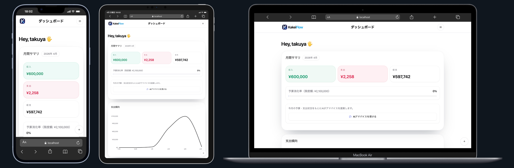
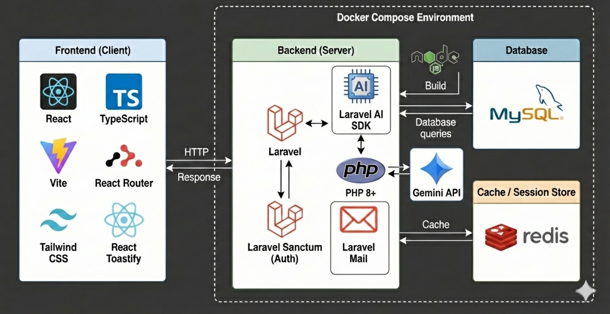

# KakeiFlow

<p align="center">
  
</p>

## 概要

-   日々の記録と振り返りをスムーズに行える、SPA ベースの家計管理アプリ
-   収入・支出・残高・予算消化率をひとつのダッシュボードで整理して確認可能
-   取引やカテゴリの管理をシンプルな操作フローで行え、継続しやすい設計
-   AIアドバイス、多言語対応、ダークモードなど、日常利用に必要な体験をコンパクトに搭載

## 技術スタック / アーキテクチャ


アーキテクチャ設計の詳細については、[docs/architecture.md](docs/architecture.md) を参照してください。

## 機能

-   月間ダッシュボードで収入・支出・残高・予算消化率を可視化
-   収入 / 支出カテゴリの追加・編集・削除
-   取引の登録・編集・削除と履歴一覧の確認
-   月次予算の設定と超過状況のチェック
-   AI による支出傾向分析とネクストアクションの提案
-   英語 / 日本語 / 韓国語の言語切替
-   ライトモード / ダークモード対応

## セットアップ

1. リポジトリをクローン
2. `.env` をコピーして設定
3. 必要なパッケージをインストール

```sh
composer install
npm install
```

---

## English

### Overview

-   A household accounting app built as an SPA for quick daily logging and easy monthly review
-   Brings income, expenses, balance, and budget usage together in a single dashboard
-   Keeps transaction and category management lightweight so the app stays easy to use continuously
-   Includes practical quality-of-life features such as AI advice, multilingual support, and dark mode

### Tech Stack / Architecture


For detailed architecture design, please refer to [docs/architecture.md](docs/architecture.md).

### Features

-   Monthly dashboard with income, expenses, balance, and budget progress
-   Add, edit, and delete income / expense categories
-   Register, edit, delete, and review transaction history
-   Monthly budget setup with overspending visibility
-   AI-powered spending analysis and actionable advice
-   Language switching for English / Japanese / Korean
-   Light mode and dark mode support

### Setup

1. Clone the repository
2. Copy and configure `.env`
3. Install required packages

```sh
composer install
npm install
```

---

## 한국어

### 개요

-   빠른 기록과 월별 점검을 자연스럽게 이어갈 수 있는 SPA 기반 가계 관리 앱
-   수입, 지출, 잔액, 예산 소진율을 하나의 대시보드에서 한눈에 확인 가능
-   거래와 카테고리 관리를 단순한 흐름으로 구성해 꾸준히 사용하기 쉬운 설계
-   AI 조언, 다국어 지원, 다크 모드 등 실사용에 필요한 기능을 간결하게 제공

### 기술 스택 / 아키텍처


아키텍처 설계에 대한 자세한 내용은 [docs/architecture.md](docs/architecture.md)를 참고해 주세요.

### 주요 기능

-   월간 대시보드에서 수입, 지출, 잔액, 예산 소진율 시각화
-   수입 / 지출 카테고리 추가, 편집, 삭제
-   거래 등록, 편집, 삭제 및 거래 이력 확인
-   월간 예산 설정과 초과 여부 확인
-   AI 기반 지출 분석 및 실천 가능한 조언 제공
-   영어 / 일본어 / 한국어 언어 전환
-   라이트 모드 / 다크 모드 지원

### 셋업

1. 저장소 클론
2. `.env` 복사 및 설정
3. 필요한 패키지 설치

```sh
composer install
npm install
